# Procesverslag
Markdown is een simpele manier om HTML te schrijven.  
Markdown cheat cheet: [Hulp bij het schrijven van Markdown](https://github.com/adam-p/markdown-here/wiki/Markdown-Cheatsheet).

Nb. De standaardstructuur en de spartaanse opmaak van de README.md zijn helemaal prima. Het gaat om de inhoud van je procesverslag. Besteedt de tijd voor pracht en praal aan je website.

Nb. Door *open* toe te voegen aan een *details* element kun je deze standaard open zetten. Fijn om dat steeds voor de relevante stuk(ken) te doen.

## Jij

Ben nog een beginnende coder. Ik begrijp html goed en css voor het grootste gedeelte, maar heb nog wel moeite met javascript

### Auteur:
Dex Twisk

#### Je startniveau:
Blauw

#### Je focus:
surface plane
 

## Je website

Ik ga de Fit For Free website namaken

### Je opdracht:
https://www.fitforfree.nl

#### Screenshot(s) van de eerste pagina (small screen): 
Homepagina
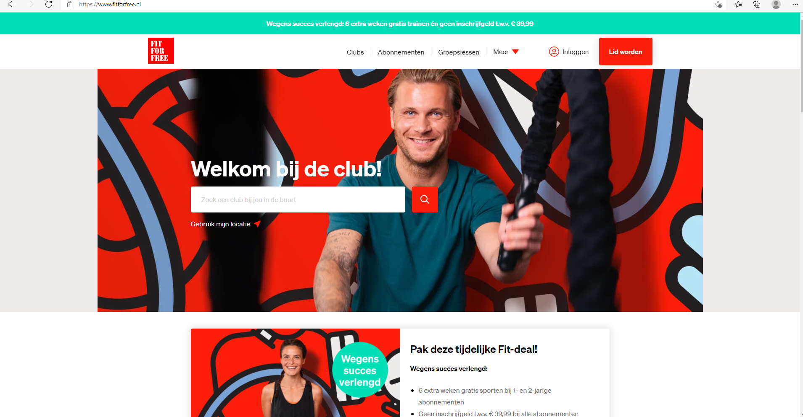

#### Screenshot(s) van de tweede pagina (small screen):
Groepslessenpagina
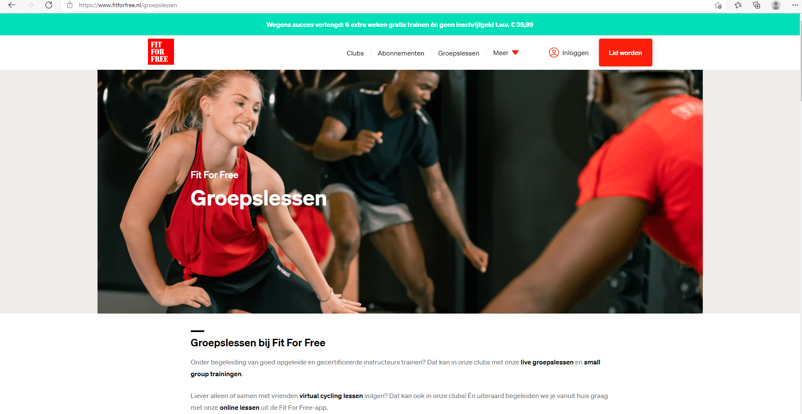
 

## Breakdownschets (week 1)

Deze week heb een breakdownschets gemaakt van de twee paagina's op de website die ik wil namaken.

### de hele pagina: 
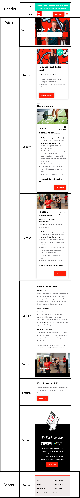

### dynamisch deel (menu): 
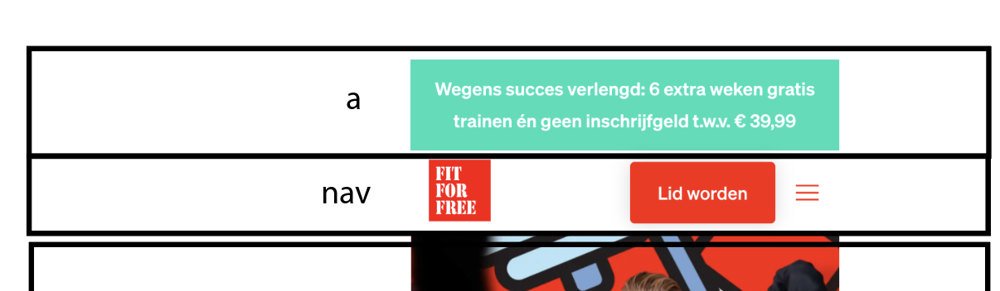

### wellicht nog een dynamisch deel (carousol slider): 
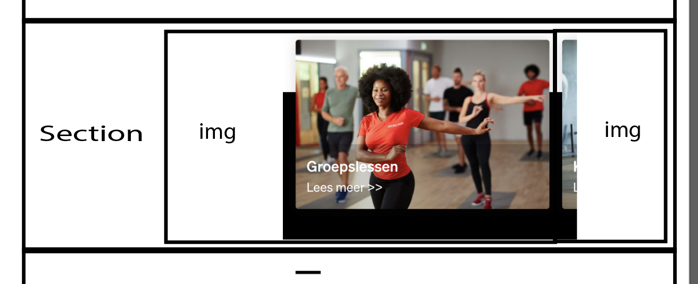

## Voortgang 1 (week 2)

Voor deze week heb ik alle html code voor de website erin gezet, daarna heb ik de html code gecontroleerd op fouten op de website validator.w3.org

### Stand van zaken
De html code voor de website ging goed, maar ik wist alleen niet goed waar ik de images moest plaatsen. Na het controleren van de code kwamen er een een aantal errors uit.

#### 1ste error in de html code: 
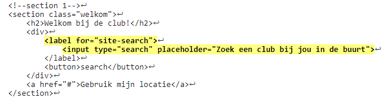

Error: Any input descendant of a label element with a for attribute must have an ID value that matches that for attribute.

#### 2de error in de html code: 
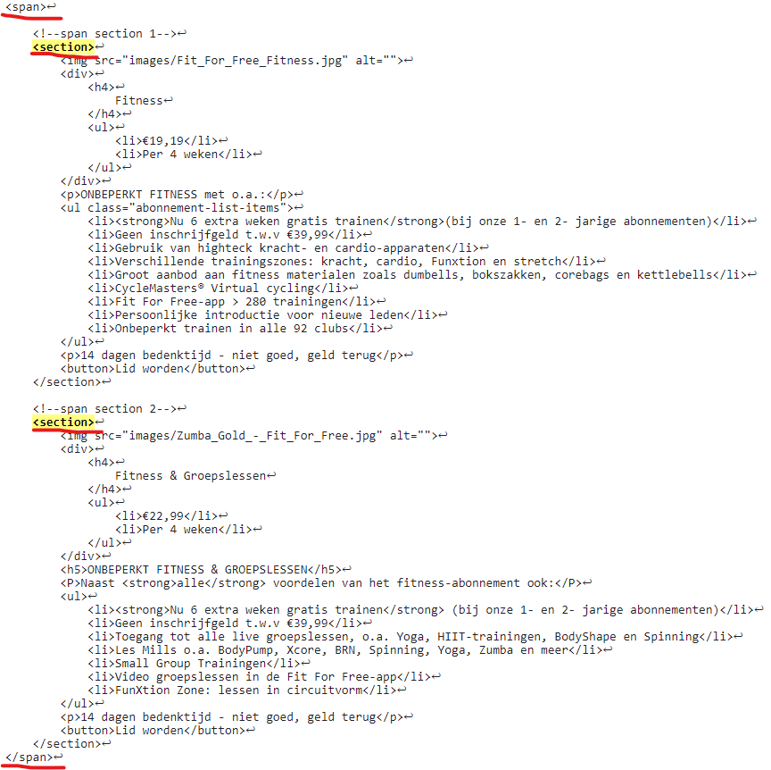

Error: Element section not allowed as child of element span in this context. (Suppressing further errors from this subtree.)

#### 3de error in de html code: 
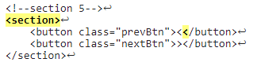

Error: Bad character < after <. Probable cause: Unescaped <. Try escaping it as &lt; .

#### 4de error in de html code: 
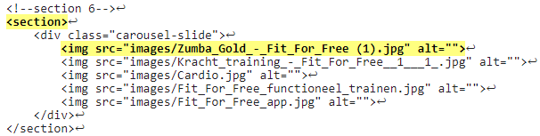

Error: Bad value images/Zumba_Gold_-_Fit_For_Free (1).jpg for attribute src on element img:

## Voortgang 2 (week 3)

Deze week ben ik bezig geweest met de styling van de website

### Stand van zaken
Ik had moeite met de eerste section waarbij er bepaalde elementen boven op een image moesten worden geplaatst.
De styling voor de rest van de website ging goed.

#### stukje css code van eerste section:
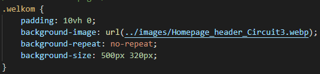

### Verslag van meeting

De styling moet verandert worden en de html code. Ik moet minder classes gebruiken en gaan werken met nth-of-type.

## Toegankelijkheidstest (week 4)

uitwerken na test in 8e voortgang

#### Slechtziend bril:

Bij de slechtziend bril is de link “Gebruik mijn locatie” niet te zien. De link heeft een te kleine font-size.

Op de search button is het contrast slecht en niet te zien.

De knoppen voor de carrousel slider zouden wel een fellere kleur kunnen hebben omdat het lichtgrijs op wit is wat een laag contrast geeft.

De tekst over de gehele website is vrij klein waardoor het moeilijk te zien is vooral met de slechtziend bril.

#### Kleurenblind:

Bij de kleurenblind bril is alles goed te zien. Het contrast word zelfs verhoog. De knoppen voor de carrousel slider zouden wel een fellere kleur kunnen hebben omdat het lichtgrijs op wit is wat een laag contrast geeft.

#### Voice over:

De hamburger menu en Fit For Free Logo is niet naar toe te tabben en dus ik niet te vinden voor iemand die de Voice over gebruikt. 

De carousel knoppen worden aangegeven als groter dan en kleiner dan knoppen.

Op de Fit For Free website zijn de abonnementen sectie geheel een link.<;
	

#### Gehandicapt hand:
De website is nog steeds goed te gebruiken. Het scrollen word moeilijk maar is te doen.

#### Mensen met parkinson: 

De navigatie links zijn te dicht bij elkaar waardoor het moeilijk word voor mensen met parkinson om op de navigatie links te klikken. De navigatie links zijn ook vrij klein dit maakt het nog extra moeilijk.

## Voortgang 3 (week 4)

Deze week heb ik gewerkt aan javascript elementen in de website en een toegankelijkheidstest afgenomen.

### Stand van zaken
Ik had erg veel moeite met het hamburger menu en de carousel sliders.
Uiteindelijk is het me gelukt om de hamburger menu en een carousel slider werkend te maken.

### Javascript code van hamburger menu:
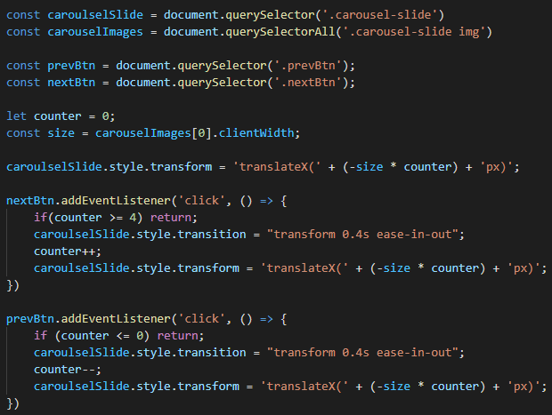

### Javascript code van carousel slider:
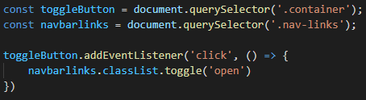

## Eindgesprek (week 5)

Ik heb afwerkingen gemaakt en de website responsive gemaakt

### Stand van zaken
Ik had moeite met het responsive maken van de website en dan vooral section 4 met de twee divs. 

### Screenshot(s)
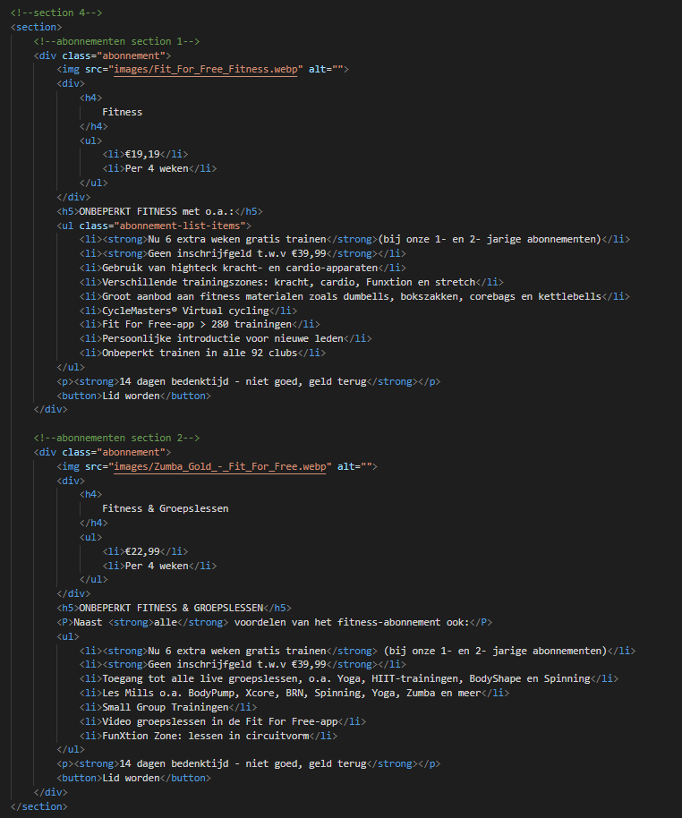
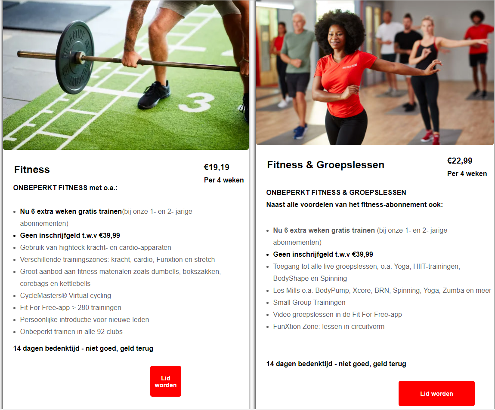

 Zoals je in screenshot kan zien zijn de image nog niet op gelijke hoogte en zijn de button niet een gelijke grote.

## Herkansing (week 6)

Ik heb mijn fouten verbeterd en voor het grootste deel een grote schoonmaak gemaakt van mijn css code

### Stand van zaken
Mijn css bestand is van 1334 code regels naar 865 code regels gegaan.
Daarnaast heb ik sommige styling veranders zoals kleur, schaduw en positionering.

#### Screenshot van vorige versie (browser screen): 
Homepagina

#### Screenshot van vorige versie (browser screen): 
Abonnementenpagina

#### Screenshot van nieuwe versie (browser screen): 
Homepagina

Ik heb de kleuren veranderd doormiddel van de kleuren vast te stellen die in de website werden gebruikt.
Dit heb ik gedaan doormiddel van Adobe Color te gebruiken.

 De buttons  heb ik een vaste width gegeven waardoor de buttons op elke responsive size even groot zijn. In de vorige versie had
ik hier problemen mee.
 

#### Screenshot van vorige versie (browser screen): 
Abonnementenpagina

## Bronnenlijst

continu bijhouden terwijl je werkt

Nb. Wees specifiek ('css-tricks' als bron is bijv. niet specifiek genoeg).

1. https://www.youtube.com/watch?v=At4B7A4GOPg
2. https://www.youtube.com/watch?v=5MeogG-ZFs8
3. https://www.youtube.com/watch?v=KcdBOoK3Pfw&t=1217s
4. https://css-tricks.com/snippets/css/a-guide-to-flexbox/
5. https://css-tricks.com/almanac/properties/b/border-radius/
6. https://developer.mozilla.org/en-US/docs/Web/CSS/gradient/linear-gradient()
7. https://color.adobe.com/nl/create/image-gradient

